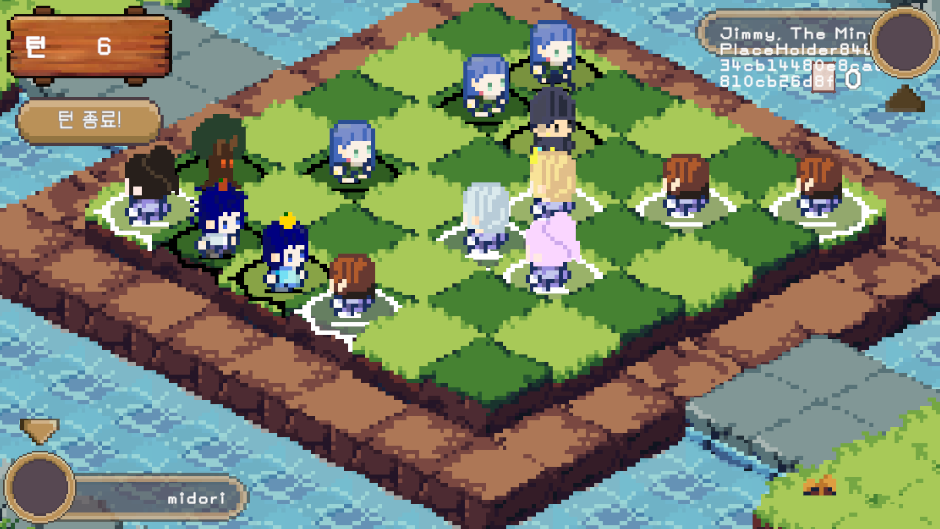
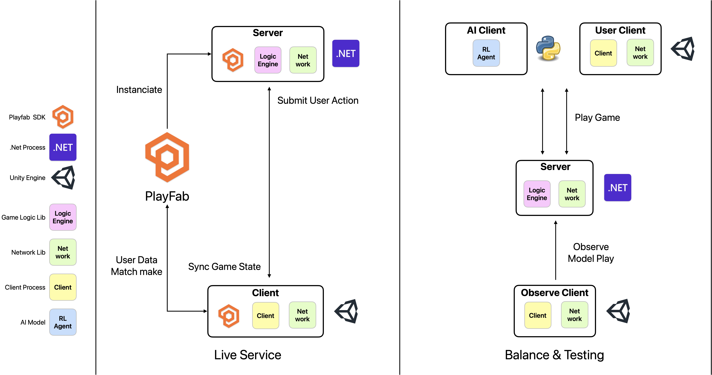
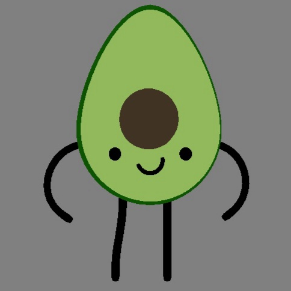
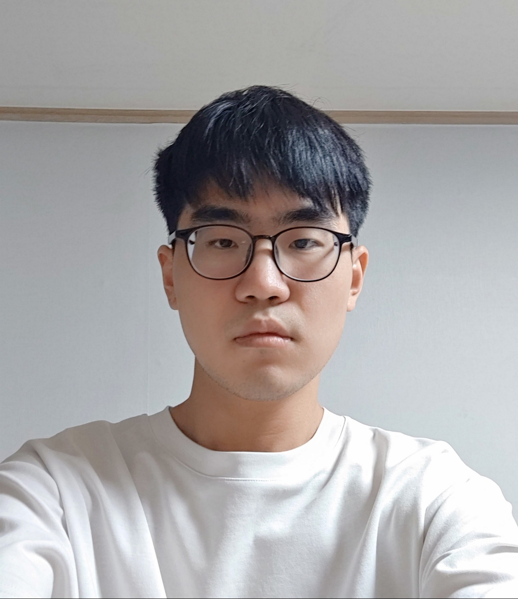

[](https://classroom.github.com/a/Lvs6kcL8)
# 2026 Call of the King - 카드게임 AI 개발 캡스톤 프로젝트

> 국민대학교 소프트웨어학부 2026 캡스톤 디자인 프로젝트

# 1. 프로젝트 소개



**"Call of the King"** 은 체스와 같은 추상 전략 게임과 CCG(Collectible Card Game)의 무작위성을 결합한 1vs1 PvP 2차원 전략 CCG입니다. 플레이어는 여러 리더 중 하나를 선택하고, 해당 리더에 대응하는 5종류 7장의 카드(군주, 비숍, 나이트, 룩 각각 1장, 폰 3장)으로 이루어진 덱을 활용하여 게임을 플레이합니다. 게임의 목표는 상대 리더 유닛을 파괴하는 것입니다.

게임은 6x6 보드 위에서 진행되며, 플레이어는 자신의 턴마다 유닛 이동, 카드 사용, 유닛 소환, 특수 효과 발동 등의 행동을 수행할 수 있습니다. Unity 엔진 기반 클라이언트와 .Net 기반 서버 및 게임 엔진으로 구성되어 TCP 통신을 통해 게임 상태 동기화 및 행동을 처리합니다.

본 프로젝트는 게임 자체의 개발뿐 아니라, **AI 밸런싱 파이프라인**을 포함합니다. PyTorch 기반 강화학습 에이전트를 사용하여 인간 플레이어 없이 통계치와 편향을 산출하고, 적은 비용과 단시간 내의 통계 기반 게임 밸런싱 작업 수행을 목표로 합니다.

> **기대효과**: 기존 6개월~1년 이상 소요되는 유저 기반 밸런싱 과정을 몇 시간 단위로 압축합니다. 개발 단계에서 수치 조정 → AI 학습 → 통계 생성을 반복하여, 라이브 서비스 투입 전 밸런스를 검증할 수 있습니다.

## 시스템 아키텍처



## 구성 요소

### [SeaEngine/](SeaEngine/) — C# 게임 엔진
- 외부 구성체와 의존 및 상태 변경을 격리
- 카드게임 "Call of the King" 핵심 로직 구현 (.NET 10.0)
- 카드의 정보와 각 효과들을 CSV 데이터와 대응되는 C# 코드로 분리
- 게임의 모든 행동은 `IEffect`(Action)와 `IEvent`(Event) 인터페이스로 추상화되며, 리플렉션으로 레지스트리에 자동 등록
- `SeaEngine.dll`로 빌드되어 Game.Server와 RL_AI에서 공유 사용

### [Game.Network/](TestTcp/Game.Network/) — 공유 통신 라이브러리
- netstandard2.1 (Unity 및 .NET 모두 호환)
- TCP 연결 관리, 패킷 인코딩/디코딩, 비동기 Request-Response 패턴
- 논 블로킹(Non-Blocking) 방식으로 게임 틱 차단 없이 네트워크 처리
- 컨트롤 이벤트 우선 처리, 미등록 핸들러 자동 폐기(Discard) 정책 적용
- Send / BroadCast / Query / Respond 4종 네트워크 프로토콜 지원
- Unity에 복사하여 클라이언트-서버 공통 사용

### [UnityChess/](UnityChess/) — Unity 클라이언트
- Unity 6.2 기반 게임 클라이언트
- EDP 아키텍처를 활용하여 EventBus 중심의 콜백 연결 구조 기반
- MVC 아키텍처로 `BoardView` / `UnitView` / `CardView` 분리 — 서버를 단일 진실 원천(Single Source of Truth)으로 사용
- 스냅샷 기반으로 게임 상태 동기화 수행
- `ChessUIController`의 FSM으로 사용자 입력 상태 관리
- PlayFab SDK 연동 — 로그인, 회원가입, 매치메이킹 지원

### [RL_AI/](RL_AI/) — Python 강화학습 파이프라인
- PPO(Proximal Policy Optimization) 알고리즘 기반 에이전트 학습
- 511차원 상태 벡터 (global 49 + hand 70 + board 392)와 63차원 action 벡터
- Transformer 기반 State Encoder + MLP Action Encoder (Actor-Critic 구조)
- 덱 조합별 4개 전문 모델 독립 학습 (귤 vs 귤 / 귤 vs 샤를로테 등)
- RL_Server를 통해 `SeaEngine.dll`과 직접 연동하여 학습 환경 구성
- 랜덤 / Greedy / 룰 기반 / 셀프플레이 대전 지원
- 다중 서버 병렬 학습으로 1.6 ep/s → 3.7 ep/s 이상 처리량 달성
- 학습 후 `server_ai_client_for_unity.py`로 Game.Server에 TCP 연결하여 실시간 AI 플레이


## 기술 스택

| 분야 | 기술 |
|------|------|
| 게임 엔진 | C#, .NET 10.0 (SeaEngine 커스텀 엔진) |
| 네트워크 통신 | C#, netstandard2.1 (Game.Network lib) |
| 게임 서버 | C#, .NET 10.0, PlayFab GSDK |
| 게임 클라이언트 | Unity 6.2, C#, PlayFab SDK |
| AI / ML | Python 3.12+, PyTorch, PPO, Transformer |
| 직렬화 | Newtonsoft.Json |
| 버전 관리 | Git / Git 빌드 및 실행 |
| 라이브 서비스 | Azure PlayFab (인증·매치메이킹·MPS) |


---

# 2. 소개 영상

[](https://www.youtube.com/watch?v=oKDYimWTmkI)

# 3. 팀 소개
| 프로필 | 이름 | 역할 | 
|-------|-------|----------------------|
|  |정희섭 (팀장) | `UnityChess` 클라이언트 개발 |
|       |김도건        | `SeaEngine` 게임 엔진 개발 |
|       |유범익        | `Game.Network` 통신 라이브러리 개발 |
|       |이동훈        | `RL_AI` 강화학습 AI 개발 |


# 4. 사용법

## 게임 엔진 빌드
```shell
dotnet build 
# 이후 해당 bin/Debug/net10.0/SeaEngine.dll 사용
```

## Unity 클라이언트 실행

#### Scene 및 진입
- `Assets/00 Scenes/Develop/Splash.unity` : 게임 메인타이틀 및 빌드시 진입 Scene
- `Assets/00 Scenes/Develop/Main Lobby.unity` : 덱 선택 및 매치 옵션 선택 
- `Assets/00 Scenes/Develop/Chess.unity` : 매치 및 게임 플레이 씬


## 게임 서버 실행

### 로컬 개발 모드
```shell
# Shell
LOCAL_DEV=1 dotnet run --project TestTcp/Game.Server/Game.Server.csproj

# PowerShell
$env:LOCAL_DEV=1; dotnet run --project TestTcp/Game.Server/Game.Server.csproj
```

### 릴리즈 빌드 (PlayFab 배포용)
```shell
dotnet publish TestTcp/Game.Server/Game.Server.csproj -r win-x64 --self-contained true -c Release
```

## AI 밸런싱 파이프라인 및 에이전트 실행

### 강화학습 수행

덱 조합(`--ai-deck`, `--opp-deck`)별로 독립 모델을 학습합니다. 병렬 서버 수(`--m-servers`)와 에이전트 수(`--n-agents`)를 실행 환경에 맞게 조절합니다.

```shell
# 전체 학습 (간편 실행)
python start.py
```

```shell
# 덱 조합별 개별 학습 + 밸런싱 지표 생성 (PowerShell 7+)
python .\train_client.py --multi --m-servers 4 --n-agents 16 --ai-deck orange --opp-deck orange    --total-episodes 10000 --stage2-episodes 0 --run-tag orange_vs_orange 

python .\make_balance_four.py --no-use-belief-mcts
```

서버 프로세스 4개, 각 에이전트 16개 병렬 실행을 수행한다.

### 통계치 산출 및 편향 분석

```shell
# 밸런스 평가
python make_balance.py

# 편향 진단
python bias_check.py
```
### Unity 클라이언트 연결
```shell
python server_ai_client_for_unity.py
```
